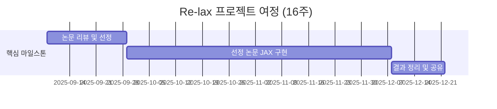

<h1 align="center"> 🚀 Re&lax - RL 을 다시 위대하게! </h1>

 

<!-- sheilds: https://shields.io/ -->
<!-- hits badge: https://hits.seeyoufarm.com/ -->

> Re(inforcement learning) & lax(jax 기본 연산) 
> 이 프로젝트 “Re&lax - RL 을 다시 위대하게!” 는 공갈빵 같던 RL 을 실속 있게 만드는걸 목표로 합니다.

## 🌟 프로젝트 목표 (Project Vision)
_"RL의 샘플 효율성과 연산 효율성, 두 마리 토끼를 잡는 JAX 기반 실험실"_

### 🎯 무엇을 연구하나요? (What we do)
느리고 비효율적인 강화학습(RL)의 한계를 **JAX**를 통해 극복합니다. 본 프로젝트는 RL의 2대 핵심 병목인 **샘플 효율성**과 **연산 효율성** 문제를 정면으로 다룹니다.

- **샘플 효율성 개선**: 최신 논문(Dreamer, BBF, TD-MPC2 등)을 리뷰하고 JAX로 직접 구현하여, 더 적은 데이터로 빠르게 학습하는 RL을 검증합니다.
- **연산 효율성 극대화**: JAX의 JIT 컴파일, 병렬 처리(vmap, pmap) 등 가속 기능을 활용해 PyTorch 등 기존 프레임워크의 오버헤드를 제거하고 GPU 연산 효율을 100%에 가깝게 끌어올립니다.

### 📝 주요 활동 및 결과물 (Activities & Deliverables)
16주 동안 **논문 리뷰 → JAX 구현 → 벤치마크** 의 워크플로우로 아래 결과물을 만듭니다.

- **핵심 결과물**: JAX 기반 샘플 효율적 RL 알고리즘 오픈소스 구현체
- **산출물**:
    - 리뷰 논문 요약 및 구현 코드 공유
    - JAX-RL 구현 경험을 담은 튜토리얼

## 🧑 역동적인 팀 소개 (Dynamic Team)

| 역할     | 이름                                                                                             | 소개                     | Github                                 |
|----------|--------------------------------------------------------------------------------------------------|--------------------------|----------------------------------------|
| **Builder**  | [정규석](https://www.notion.so/24b963ffa3ee8034af69d805ef862767?pvs=21)                             | RL 을 짝사랑하는 사람입니다. | [tinker495](https://github.com/tinker495) |
| **Runner**   | [강동화](www.linkedin.com/in/donghwa-kang-ab37471a2)     | RL을 업무에 활용하려고 하는 사람입니다. | [dhkang8828](https://github.com/dhkang8828) |
| **Runner**   | [진승정](https://www.linkedin.com/in/seung-jung-jin/)     |  |  |
| **Runner**   | [김민성](www.linkedin.com/in/minsung-kim-5454b237a)      |  | [mskim46](https://github.com/mskim46)  |

## 🚀 프로젝트 로드맵 (Project Roadmap)

## 💻 주차별 활동 (Activity History)

**진행 및 발표**

- 첫 주차는 빌더의 OT 및 세미나가 진행됩니다.
- 첫 주차 이후 2주차 전까지 리뷰할 논문을 논의하고 선정합니다.
- 각각 논문을 최소 1개, 가능하면 2개 리뷰 합니다.
    - 구현 난이도나 이해도 측면에서 어떤 논문을 구현할지 고민 된다면 2개를 리뷰하고 참석자들이 함께 고민해주는 시간을 가집시다!
- 모든 리뷰 이후 각각 1인 1논문을 잡아 구현을 시작하고 매주 서로 진행 사항을 공유합니다.
    - 목표하는 구현의 난이도가 극악 이라고 모두 공감하거나, 구현하고 싶은 논문이 동일하면 협업을 해도 좋다고 생각합니다.

| **주차** | **담당자** | **주제/분량** | **발표/실험/리뷰 내용** | **결과물 유형** |
| --- | --- | --- | --- | --- |
| 1주차 | 정규석 | Why RL is not Efficient? | OT 진행, 공동 git 생성 | 발표자료 |
| 2주차 | A, B | 논문 A 논문 B | 논문 PPT 발표 | 발표자료 |
| 9/22 | N/A | Magical Week | 휴식! |  |
| ... | ... |  |  |  |
| N주차 | 전부 | 구현할 논문 분배 | 구현 git 레포 생성 | git |
| N+1 | 전부 | 구현 진척 사항 공유 | 구현 git 레포 갱신 | git |
| 10/27 | N/A | Magical Week | 휴식! |  |
| ... | ... |  |  |  |
| 16주 | 전부 | 마무리! |  | git |

## Acknowledgement 🙏

이 프로젝트는 가짜연구소 Open Academy로 진행됩니다.
여러분의 참여와 기여가 ‘우연한 혁명(Serendipity Revolution)’을 가능하게 합니다. 모두에게 깊은 감사를 전합니다.
This project is developed as part of Pseudo-Lab's Open Research Initiative. Special thanks to our contributors and the open source community for their valuable insights and contributions.

## About Pseudo Lab 👋🏼</h2>

[Pseudo-Lab](https://pseudo-lab.com/) is a non-profit organization focused on advancing machine learning and AI technologies. Our core values of Sharing, Motivation, and Collaborative Joy drive us to create impactful open-source projects. With over 5k+ researchers, we are committed to advancing machine learning and AI technologies.

<h2>Contributors 😃</h2>

  

<h2>License 🗞</h2>

This project is licensed under the [MIT License](https://opensource.org/licenses/MIT).
